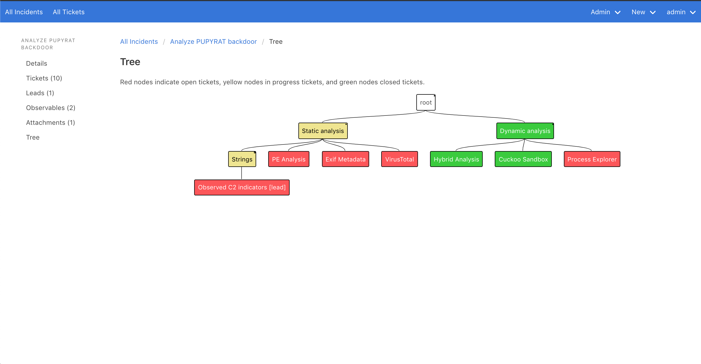

# Incidents

Incidents is a web application for managing non-trivial security incidents.

When you first encounter a phishing email, a malware infection, an application
vulnerability, a suspicious login, an act of abuse by an insider, or another
security incident, your security team may create a Slack channel, or a Google
Doc, or a JIRA ticket, to investigate it.

As the investigation's scope increases, though, these tools aren't enough to
manage the incident's complexity.

You might have a dozen people working on 30-40 tasks at once:

- collecting forensic data
- conducting forensic analysis
- running sweeps
- remediating
- fixing technology issues
- asking your vendors for logs
- notifying affected users
- communicating with upper management, etc

It's difficult to stay up to date on an incident where all these workstreams are juxtaposed in the same chat channel.

Our insight is that incidents are trees of tickets, where some tickets are
leads.



- Found multiple threat actors in an environment? Create a ticket for each
  threat actor (under the root) and assign each ticket to someone to investigate.
- Similarly, you can create a root ticket for each involved team: forensics,
  remediation, IT, helpdesk, legal, etc. Each team can work in parallel but have
  visibility into other teams' work.
- Want to reorganize your tree? You can do that.
- You're done investigating an incident once you've generated every possible
  lead and resolved each lead.
- Management can look at the incident's tree to find out what's going on

Incidents tames complexity because each person only has to worry about the layer
below them. The incident manager doesn't have to talk to forensic analysts; he
only has to talk to the forensic team's manager.

## Installation
### To get it running locally:
```
# build docker image
docker-compose build

# create and migrate database
docker-compose run web rake db:create db:migrate

# start application
docker-compose up

# create initial user (see below)
docker-compose exec web rails console
```

Create initial user:

```
user = User.new(username: 'admin', email: 'admin@protonmail.com', password: 'mypassword')
user.save
```

Then visit http://localhost:80

### To run in production:
Coming soon!
