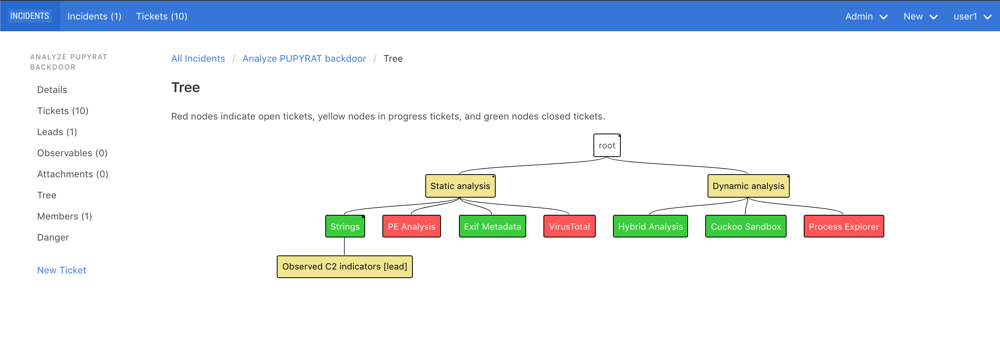

# INCIDENTS

INCIDENTS is a web-based, actively maintained case management tool for incident response, just like
[TheHive](https://thehive-project.org).

You can use INCIDENTS whether you're investigating a malware infection, a
phishing campaign, insider abuse, an application vulnerability, a
denial-of-service attempt, or any other kind of security incident.

If you work at a SOC, MSSP, incident response firm, or an internal
detection/response team, INCIDENTS is for you.

## Why INCIDENTS?

Investigations are tree-like: a piece of malware may spawn an enterprise-wide sweep, which may find a related piece of malware, which may spawn
another sweep, and so on.

Unfortunately, existing ticketing systems -- like TheHive and JIRA -- don't let you create subtickets of subtickets. So effectively your
tree can only have 2 levels--and they don't show you a visualization of the tree, either.

INCIDENTS models an incident as a tree of tickets, with any number of levels.

I believe this approach better captures an incident responder's mental model of
an incident.

## Benefits
- **Avoid missing things with centralized lead management**--whether you're analysing a single system or leading a large engagement
- **Keep people on the same page**--team members can glance at the tree to find out what's going on, instead of reading old status updates or reading the entire Slack channel
- **Complete investigations faster**--divide large tasks into smaller tickets you assign to people to get things done in parallel. And analysts can identify open tickets to work on, without waiting for the investigation lead
- **Preserve institutional knowledge**--document how investigations developed over time to reference in future incidents and for training new analysts
- **Improve your IR process**--by documenting an investigation's evolution, be able to look back and find bottlenecks, areas for improvement, opportunities for automation
- **Tame incidents with large scopes**--people only need to worry about the few levels in the tree below theirs, instead of being exposed to all the information about the incident

## Concepts

- Create an **incident** for each investigation
- Each incident has many **tickets**, or pieces of work.
- If a ticket needs to be investigated further, mark it as a **lead**.
- Add **comments**, **attachments**, and **observables** (aka indicators) to a ticket.
- Add **child tickets** to a ticket to break it down into smaller pieces, or to indicate the ticket spawned another piece of work.

## Features

- Restrict who can view an incident
- View all an incident's attachments in one place
- View all an incident's observables in one place
- View all an incident's leads in one place
- Drag/drop nodes in the tree to quickly reorganize an incident
- Tag indicators, attachments, tickets, and incidents
- Assign tickets to users
- Assign statuses and priorities to tickets
- Keyboard shortcut for creating an incident

## Tech Stack

INCIDENTS is built using:
- Ruby on Rails
- ActionText
- Bulma
- JQuery

## Get in Touch
To request a feature or report a bug, [please open an issue on GitHub](https://github.com/veeral-patel/incidents/issues)

You can email the author at [veeral.patel@berkeley.edu](mailto:veeral.patel@berkeley.edu). I reply to all emails, and most within a couple hours. I welcome feedback!

We're on [Gitter](https://gitter.im/incidents-oss/community), too.
