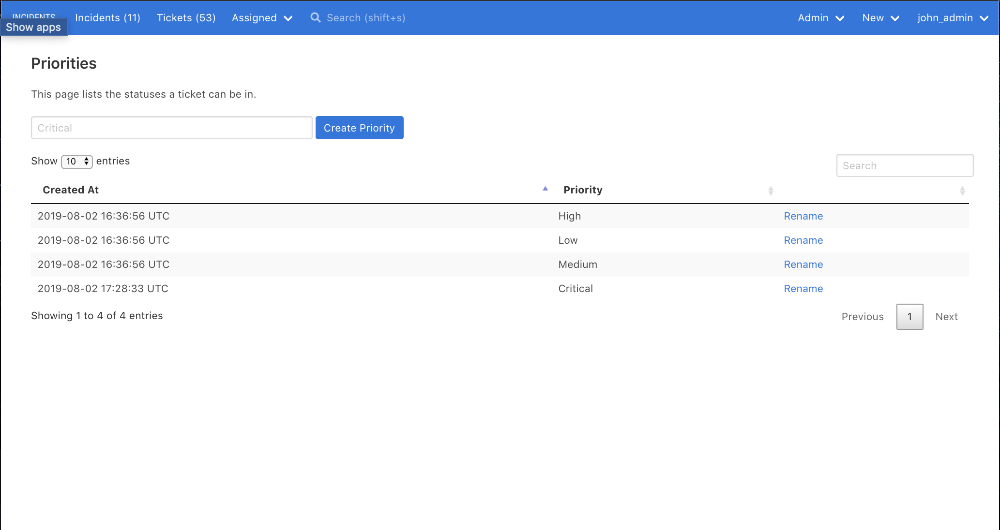

# Custom Priorities

Every ticket and incident has a (required) priority.

Though INCIDENTS ships with some default priorities, you can rename existing priorities and add your own priorities, in order to customize INCIDENTS to fit your organization's processes.

For example, you might add a `Critical` priority, in addition to the default priorities. Or you may choose to follow a `P0`/`P1`/`P2` scheme.

## Renaming/adding priorities

Visit `Admin > Priorities` to rename/add priorities.

Only admins will see the `Admin` dropdown in the top navigation bar. Only admins can rename/add priorities.

## Default priorities

By default, your priority options are:

- Low
- Medium
- High

The default priorities are highlighted in tables in the web UI; custom priorities are not.

## Deleting priorities

You can't delete priorities in INCIDENTS for the same reason you can't delete statuses: deleting a priority would delete all incidents and tickets that have that priority.

Instead, you could rename a priority to add `[don't use]` or `[disabled]` at the end of the priority's name.
