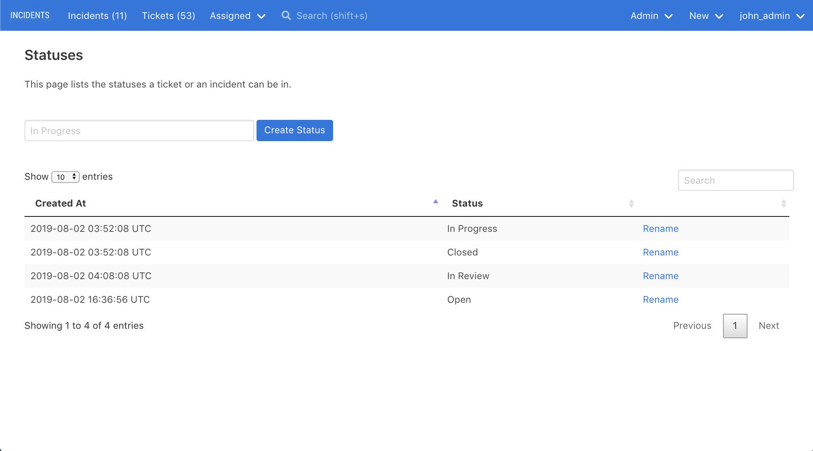

# Custom Statuses

Every ticket and incident has a (required) status.

Though INCIDENTS ships with some default statuses, you can rename existing statuses and add your own statuses, in order to customize INCIDENTS to fit your organization's processes.

For example, you may create a `In Review` status, if you need a manager to review each incident before it gets closed.

## Renaming/adding statuses

Visit `Admin > Statuses` to rename/add statuses.

Only admins will see the `Admin` dropdown in the top navigation bar, and only admins can rename/add statuses.

## Default statuses

By default, your status options are:

- Open
- In Progress
- Closed

The default statuses are highlighted in tables in the web UI; custom statuses are not.

## Deleting statuses

Deleting a status is not supported, as deleting a status would delete all incidents and tickets that have that status.

Instead, you could rename a status to add `[don't use]` or `[disabled]` at the end of the status's name.
