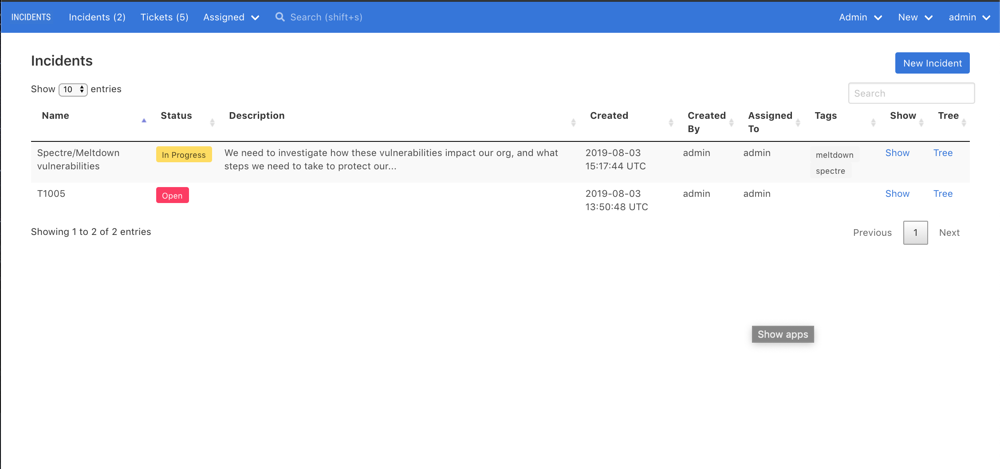
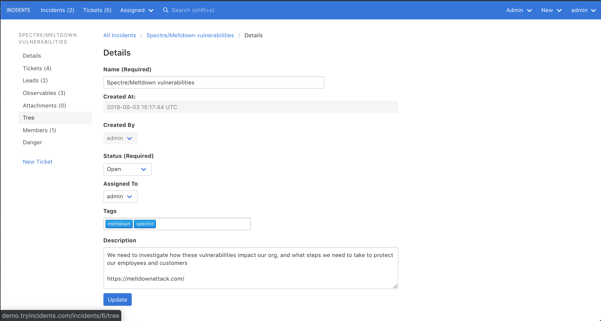

# Incidents

## What is an incident?

The core construct in INCIDENTS is that of an incident. Think of an incident as a case.

### Use cases

For example, you may open an incident to investigate:

- a malware infection
- a phishing email
- a suspicious VPN login
- an insider threat

INCIDENTS is not aware of, and is agnostic to, what your incident's purpose is.

### Not necessarily a declared incident

An incident in INCIDENTS doesn't have to be a declared security incident. You could create an incident for:

- hunting through logs
- reviewing alerts
- analyzing a piece of malware

Basically, open a new incident for every new investigation you work on.

## What can you do with an incident?

Incidents are composed of tickets. You can add/remove tickets, plus:

- assign the incident to someone
- add tags to the incident
- change the incident's status
- add users to the incident -- [learn more about incident permissions](/incident_permissions/)
