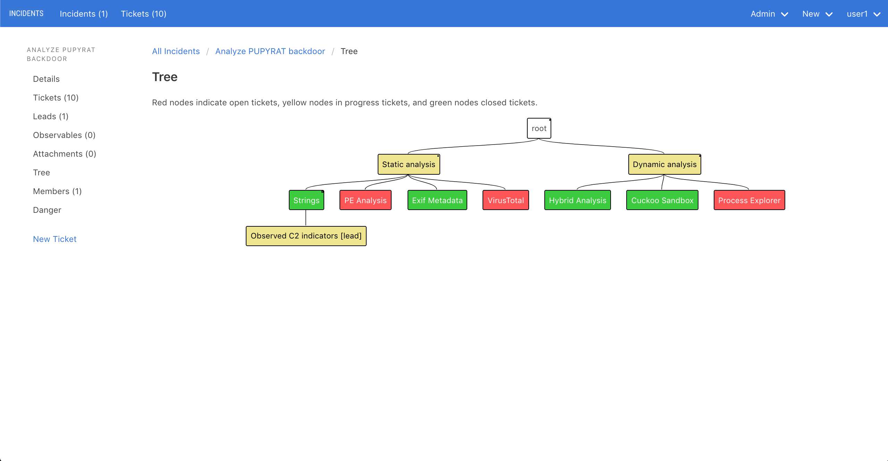

# Overview

INCIDENTS is an open source web application for incident response, just like [TheHive](https://thehive-project.org).

## Investigations are tree-like

Investigations are tree-like: a piece of malware may spawn an enterprise-wide sweep, which may find another piece of malware, which may spawn
another sweep, and so on.

But existing ticketing systems, like TheHive and JIRA, don't let you create
subtickets of subtickets.

_INCIDENTS models incidents as a tree of tickets, like this:_

## Concepts

- Create an **incident** for each investigation
- Each incident has many **tickets**, or pieces of work.
- If a ticket needs to be investigated further, mark it as a **lead**.
- Add **comments**, **attachments**, and **observables** (aka indicators) to a ticket.
- Add **child tickets** to a ticket to break it down into smaller pieces, or to indicate the ticket spawned another piece of work.
