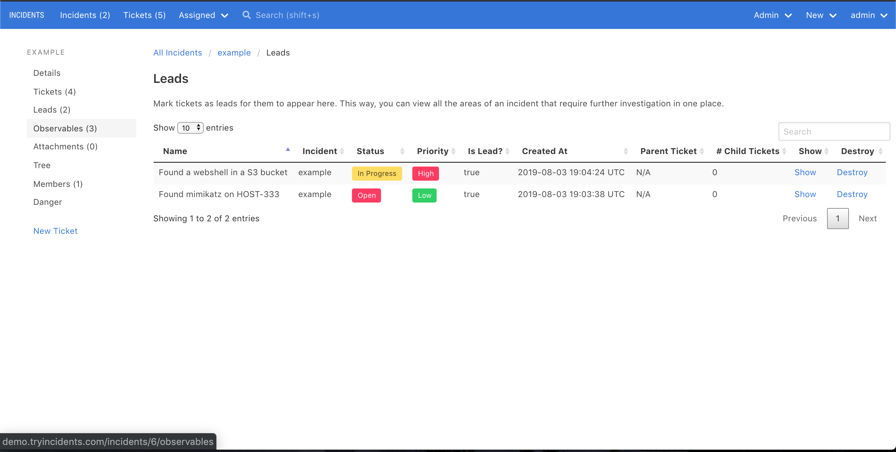

# Leads

This is my mental model for an investigation:

```
while there are more leads:
    generate more leads from the existing leads
```

For example, say you're forensically analyzing a hard disk.

1. You typically start off with a lead
2. You generate additional leads by doing keyword searches and timeline analysis
3. You repeat this process until you run out of leads

INCIDENTS supports this mental model by letting you mark a ticket as a lead.

Once you do this, you can view all an incident's leads on one page:


