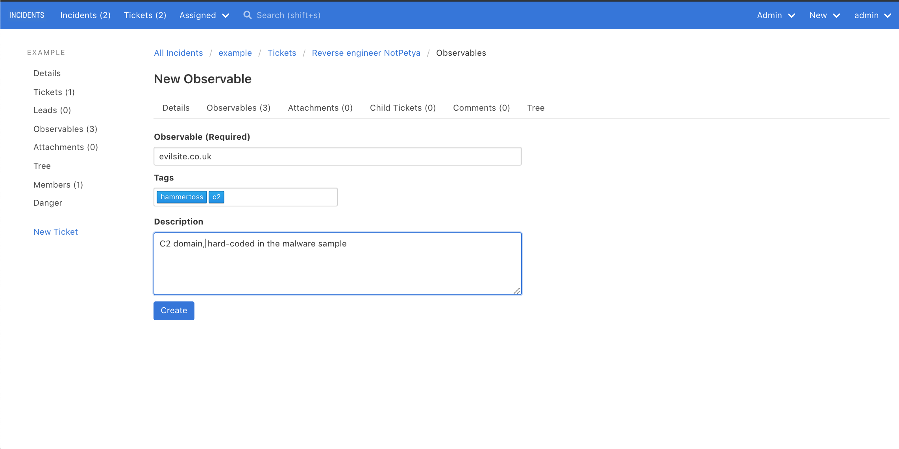

# Observables

## What is an observable?

INCIDENTS calls indicators observables, because it's possible an observable doesn't indicate a compromise -- it could
be a false positive.

Semantics aside, an observable is exactly what you think it is: an IP address, file hash, domain, URL, etc. that
indicates bad activity.

## Adding an observable to a ticket

It's easy! Find the ticket, click the "Observables" tab, then click "New Observable".

### Caveats

When you create an observable, INCIDENTS doesn't validate its name at all. You can create an observable with a defanged IP, a regular IP, or a malformed IP with 5 quartets, all perfectly fine.

Also, INCIDENTS doesn't know about, and is agnostic, to each observable's type. There's no additional functionality available if you add say, a domain, instead of say, an IP address.

## View all an incident's observables

You can view and search all of an incident's observables in one place. This is useful, for example, if you want to blacklist all of an incident's indicators after you close an incident or you want to check if an observable you've found has already been seen.

Simply visit the incident's Observables tab; it looks like this:

