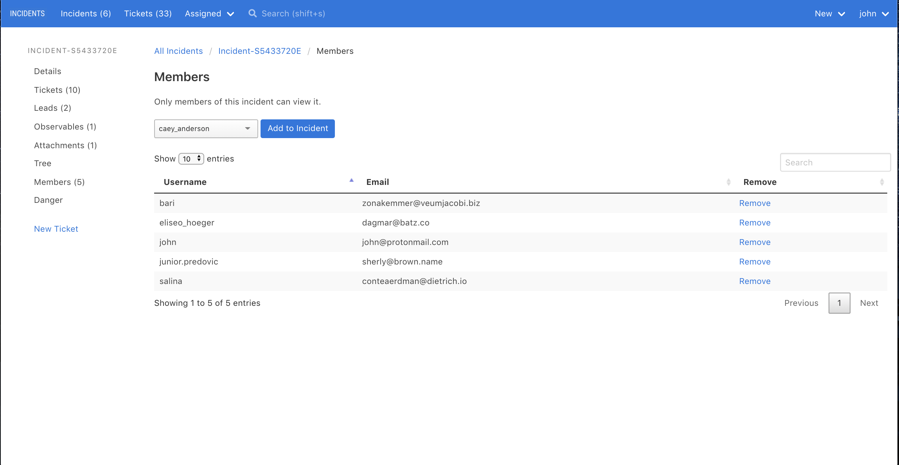

# Restrict Access to an Incident

INCIDENTS lets you restrict who can view an incident.

### The basic model

- When you first create an incident, only you can view it.
- Add members to your incident in Members.
- Admins can view all incidents.
- Non-incident members can't view, edit, or delete the incident, its tickets, its observables, its comments, its attachments, or any of its other associated objects.
- In fact, non-incident members will not even know the incident exists; the incident won't be listed for them on the Incidents page.

### No RBAC

Either you are an incident member, or you are not. All incident members can do the same things,
including:

- Editing an incident's name, description, assigned user, status, priority, tags, and other details
- Creating, deleting, editing tickets
- Adding observables, comments, and attachments to tickets
- Destroying the incident itself

Currently, there are no finer grained permissions or roles you can apply to an incident member to limit his abilities.

You also cannot disallow users from doing actions not tied to a specific incident, such as "create incident".
