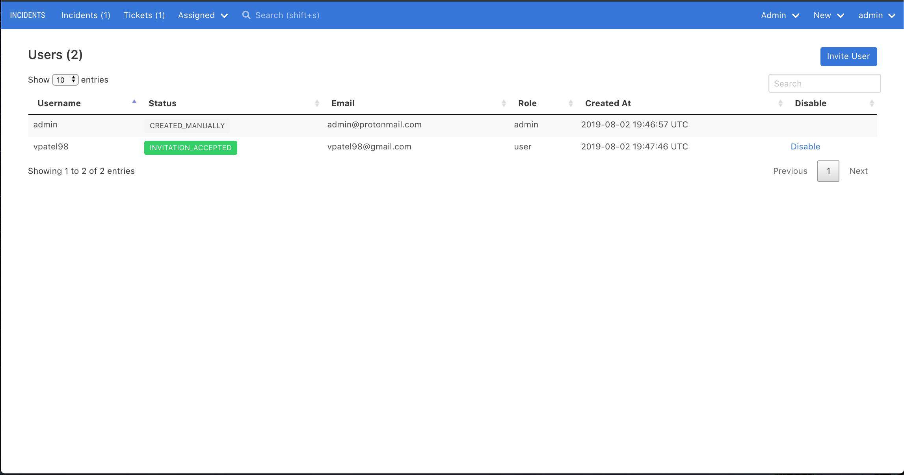

# User Management

To add/remove users to INCIDENTS, you must be an admin. Visit `Admin > Users` in the top navigation bar.

## Adding users

To add an user, enter her email address to send her an
invitation to create an account.

## Disabling users

- You cannot disable an user who's been sent, but hasn't accepted, an invitation.
- You cannot disable the last enabled admin user.
- You cannot disable the last enabled user (who's probably an admin!).

## Admin role

An user can be either an admin or a normal user.

An admin can do everything a normal user can, plus:

- view every incident (not just the incidents he's a member of)
- add users to INCIDENTS
- remove users from INCIDENTS
- add/edit statuses
- add/edit priorities

Currently, there's no way to elevate an existing user to an admin from the web interface.

## User statuses

An user can have a status of:

- **DISABLED**: User is soft deleted and cannot log in.
- **INVITATION_PENDING**: The user has been sent, but hasn't accepted, an invitation
- **INVITATION_ACCEPTED**: The user has been sent and has accepted an invitation
- **CREATED_MANUALLY**: This user wasn't created via invitation. This is likely the initial user, created using the Rails console.
